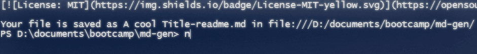
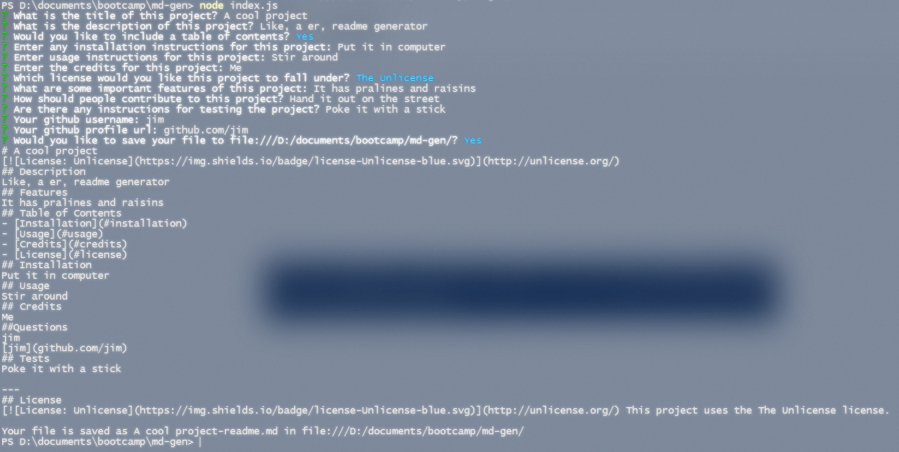

# md-gen

## Description

This is a CLI readme.md generator for projects. It was made with node.js

## Installation

Extract or clone the repo into where you want your readme, or add its directory to $path.

## Usage

Run node md-gen if it's in $path or node index.js from within the folder. It will walk you through the rest of the steps.

## Credits

stackoverflow mostly

## License

